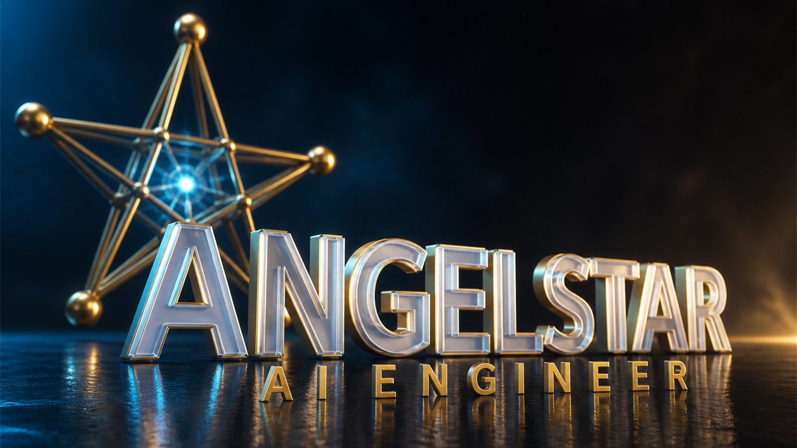
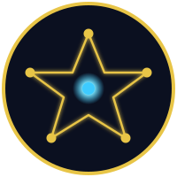
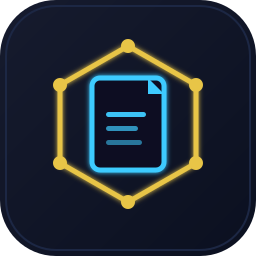
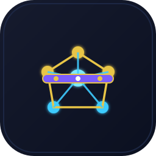
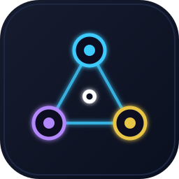
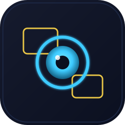
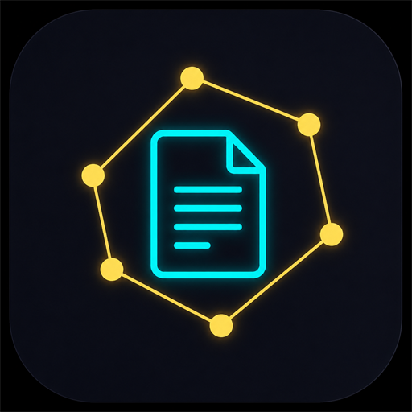
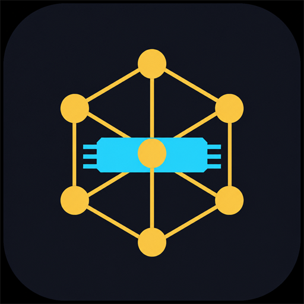
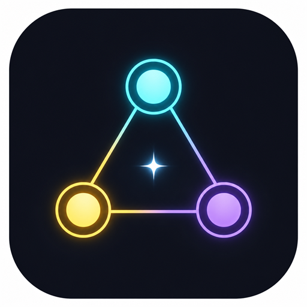
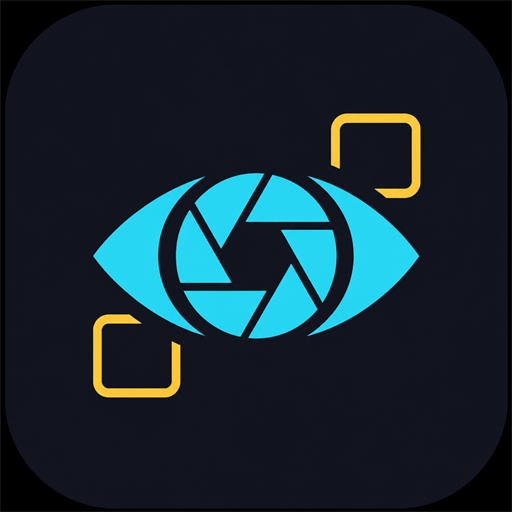

  

 

  

<h1 align="center">Hi, I'm AngelStar</h1>

  <strong>AI Engineer</strong> · LLMs · RAG · Agents · Computer Vision

  

  
  
  
  

  

## About

AI Engineer with **5 years** of professional experience designing, developing, training, evaluating, and deploying machine learning and generative AI solutions.

Strong background in **Large Language Models**, **NLP**, **computer vision**, **retrieval-augmented generation**, **AI agents**, **model fine-tuning**, and **scalable inference**. I build end-to-end AI pipelines — from data preparation and experimentation through production deployment, monitoring, and optimization.

Combines advanced AI engineering with an **MBA-level** understanding of business strategy, product development, operations, and data-driven decision-making.

  

## What I Build

<table>
  <tr>
    <td align="center" width="25%">
       
      <strong>RAG Systems</strong> 
      Grounded retrieval & generation
    </td>
    <td align="center" width="25%">
       
      <strong>Fine-Tuning</strong> 
      LoRA · QLoRA · eval harnesses
    </td>
    <td align="center" width="25%">
       
      <strong>AI Agents</strong> 
      Tools, state, production reliability
    </td>
    <td align="center" width="25%">
       
      <strong>Computer Vision</strong> 
      Detection · OCR · ViTs
    </td>
  </tr>
</table>

  

<h2 align="center">Tech Stack</h2>

### Programming

  

  
  
  
  
  
  

### AI & Machine Learning

  

<table align="center">
  <tr>
    <td align="center" width="88">
       <b>XGBoost</b>
    </td>
  </tr>
</table>

### Generative AI & LLM Platforms

  

<table align="center">
  <tr>
    <td align="center" width="88">
       <b>Llama</b>
    </td>
    <td align="center" width="88">
       <b>Qwen</b>
    </td>
    <td align="center" width="88">
       <b>OpenRouter</b>
    </td>
  </tr>
</table>

  
  
  
  
  
  
  
  
  

### NLP

  

  
  
  
  
  

### Computer Vision

  

  
  
  
  
  
  

### Vector Databases

  

<table align="center">
  <tr>
    <td align="center" width="88">
       <b>FAISS</b>
    </td>
    <td align="center" width="88">
       <b>Chroma</b>
    </td>
    <td align="center" width="88">
       <b>Weaviate</b>
    </td>
  </tr>
</table>

### Backend & APIs

  

  
  
  

### Data Engineering & Databases

  

  

### Cloud, MLOps & DevOps

  

<table align="center">
  <tr>
    <td align="center" width="88">
       <b>DVC</b>
    </td>
    <td align="center" width="88">
       <b>MLflow</b>
    </td>
    <td align="center" width="88">
       <b>W&B</b>
    </td>
  </tr>
</table>

  
  

  

## Featured Projects

<table>
  <tr>
    <td align="center" valign="top" width="50%">
      
      <h3>Enterprise Retrieval-Augmented Generation Platform</h3>
      

        
        
        
        
      

      

        End-to-end RAG platform for PDF, DOCX, HTML, and structured enterprise data.  
        Semantic chunking, embeddings, vector retrieval, metadata filtering, reranking, and LLM response generation.  
        Evaluation for retrieval relevance, answer quality, hallucination rate, and end-to-end latency.
      

    </td>
    <td align="center" valign="top" width="50%">
      
      <h3>LLM Fine-Tuning and Evaluation System</h3>
      

        
        
        
        
      

      

        Fine-tuned open-source LLMs with LoRA and QLoRA for domain-specific NLP.  
        Benchmark datasets and automated evaluation pipelines across foundation models.  
        Inference optimized with quantization, caching, batching, and prompt engineering.
      

    </td>
  </tr>
  <tr>
    <td align="center" valign="top" width="50%">
      
      <h3>AI Agent Automation Platform</h3>
      

        
        
        
        
      

      

        Multi-step agents combining LLM reasoning, APIs, databases, retrieval, and structured tools.  
        Validation, retry logic, error handling, state management, and monitoring for production workflows.
      

    </td>
    <td align="center" valign="top" width="50%">
      
      <h3>Computer Vision Recognition System</h3>
      

        
        
        
        
      

      

        Image-processing and deep-learning pipelines for classification and object recognition.  
        Data augmentation, transfer learning, preprocessing, and model optimization for stronger generalization.
      

    </td>
  </tr>
</table>

  

## GitHub Analytics

  
  

  

  

  

   
  <strong>Building AI that ships — and scales.</strong> 
  LLMs · RAG · Agents · Vision · Production ML

